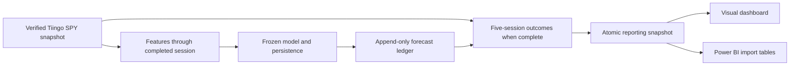

# Integrating the SPY volatility model for shadow testing

The V8A model forecasts annualized volatility over the next five SPY sessions. Its API and daily
runner support operational testing only: the provisional promotion result is `target_not_met`.
The model caught 1 of 13 high-volatility outcomes in V8A, versus 2 for persistence, even though
continuous forecast losses improved. A forecast is not a return prediction or a trading instruction.

## Integration flow

The existing API accepts the 20 calculated features. The V9 runner owns data validation, causal
feature construction, durable forecast recording, outcome maturation, and reporting. Keep one
ledger per frozen model and execution mode. Model and threshold changes require a new ledger.

## Timing and evidence

Live runs use the actual execution clock and the latest completed XNYS session. They reject stale
prices, unfinished sessions, and forecasts created after the next session has opened. Save the
forecast before any of its five future sessions begin. Historical replay is explicitly marked
`replay`; its simulated clock cannot establish prospective forecast performance.

Forecast records retain origin, availability and creation times, five-session horizon, source and
model hashes, feature values, candidate forecast, persistence, and the fixed alert threshold.
Outcomes are separate immutable records. Pending outcomes remain null. Only complete, valid
outcomes enter error measures. Unique keys and transactions make repeated runs safe.

Use one coherent adjusted-price snapshot for each outcome's six closing prices. Provider revisions
must never splice old adjusted prices with newly adjusted prices or rewrite recorded forecasts.
Archive source versions and retain the first measured outcome for reproducibility.

## Implementation and acceptance

V9 adds:

1. Container and API replay verification against all saved V8A forecasts.
2. A daily command for verified saved snapshots or an explicit Tiingo fetch.
3. An append-only SQLite ledger, completed-outcome scoring, and rerun protection.
4. An automatically refreshed local dashboard and typed Power BI tables, queries, and measures.

Acceptance requires feature parity with research, invariance to later prices, no premature
outcomes, duplicate-free reruns, honest replay/live labeling, metric reconciliation, and API
prediction parity. Container execution and rendered browser inspection are reported separately.

## Promotion evidence boundary

The V8A YTD outcomes are exposed. A full-year 2026 summary overlaps those observations and cannot
be described as a wholly untouched independent confirmation. Preserve the original V8/V8A
protocols and results; operational monitoring does not weaken their gates or reopen their ledgers.
A future independent promotion test needs a protocol frozen before its unseen outcomes are used.

The run commands, Power BI model, refresh configuration, and measured verification results are
documented below as the implementation is completed.
