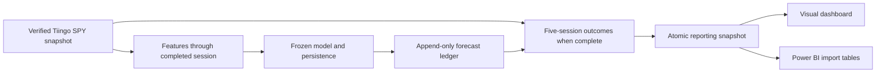

# Integrating the SPY volatility model for shadow testing

The V8A model forecasts annualized volatility over the next five SPY sessions. Its API and daily
runner support operational testing only: the provisional promotion result is `target_not_met`.
The model caught 1 of 13 high-volatility outcomes in V8A, versus 2 for persistence, even though
continuous forecast losses improved. A forecast is not a return prediction or a trading instruction.

## Integration flow



The existing API accepts the 20 calculated features. The V9 runner owns data validation, causal
feature construction, durable forecast recording, outcome maturation, and reporting. Keep one
ledger per frozen model and execution mode. Model and threshold changes require a new ledger.

## Timing and evidence

Live runs use the actual execution clock and the latest completed XNYS session. They reject stale
prices, unfinished sessions, and forecasts created after the next session has opened. Save the
forecast before any of its five future sessions begin. Historical replay is explicitly marked
`replay`; its simulated clock cannot establish prospective forecast performance.

Forecast records retain origin, availability and creation times, five-session horizon, source and
model hashes, feature values, candidate forecast, persistence, and the fixed alert threshold.
Outcomes are separate immutable records. Pending outcomes remain null. Only complete, valid
outcomes enter error measures. Unique keys and transactions make repeated runs safe.

Use one coherent adjusted-price snapshot for each outcome's six closing prices. Provider revisions
must never splice old adjusted prices with newly adjusted prices or rewrite recorded forecasts.
Archive source versions and retain the first measured outcome for reproducibility.

## Implementation and acceptance

V9 adds:

1. Container and API replay verification against all saved V8A forecasts.
2. A daily command for verified saved snapshots or an explicit Tiingo fetch.
3. An append-only SQLite ledger, completed-outcome scoring, and rerun protection.
4. An automatically refreshed local dashboard and typed Power BI tables, queries, and measures.

Acceptance requires feature parity with research, invariance to later prices, no premature
outcomes, duplicate-free reruns, honest replay/live labeling, metric reconciliation, and API
prediction parity. Container execution and rendered browser inspection are reported separately.

## Promotion evidence boundary

The V8A YTD outcomes are exposed. A full-year 2026 summary overlaps those observations and cannot
be described as a wholly untouched independent confirmation. Preserve the original V8/V8A
protocols and results; operational monitoring does not weaken their gates or reopen their ledgers.
A future independent promotion test needs a protocol frozen before its unseen outcomes are used.

## Run a complete offline test

From the repository root with the project virtual environment active:

```bash
python -m qr_haven.ml.volatility.shadow run \
  --mode replay \
  --snapshot-dir data/raw/market_data/tiingo/spy-2025-10-01-2026-10-02-v1 \
  --start 2026-01-02 \
  --root artifacts/classification/volatility/tiingo-spy-v1/shadow/replay-v1
```

This uses the saved data, creates features through October 2, records forecasts, scores completed
outcomes, and refreshes reports. `--through YYYY-MM-DD` can stop replay on an earlier session; a
subsequent run can advance it. A ledger cannot move backwards. Repeating the same command adds no
duplicate forecasts or outcomes. It publishes a new reporting generation with current freshness.

The local replay has **189 origins, 184 scored and five pending**. The pending origins are the last
five sessions in the source; their future data are absent. This is an engineering replay of
provider-revised history, not a reconstruction of what Tiingo actually delivered on those dates.

```text
artifacts/classification/volatility/tiingo-spy-v1/shadow/replay-v1/
├── ledger.sqlite               # immutable forecast/outcome rows and run history
├── sources/                    # hashed canonical input versions and provenance
├── checks/                     # integration verification evidence
└── reports/
    ├── current.json            # atomic pointer to a complete generation
    ├── current/                # convenience symlink to that generation
    └── generations/<id>/
        ├── dashboard.html
        ├── summary.json
        ├── manifest.json
        └── power_bi/           # typed CSVs, Power Query, DAX, schema, dictionary
```

Open `reports/current/dashboard.html` locally. It is self-contained and makes no external requests.
Date and outcome filters change the cards, charts, metrics, records, and CSV download together.
The operational status section always describes the full ledger. Pending-only selections show no
accuracy measures. Errors are compared on the same scored origins for both models.

## Start the API and dashboard

For the replay deployment:

```bash
docker compose -f infrastructure/volatility-api/compose.yaml \
  -f infrastructure/volatility-api/compose.replay.yaml up --build -d volatility-api
python scripts/verify_volatility_shadow.py \
  --api-url http://127.0.0.1:8000 \
  --output artifacts/classification/volatility/tiingo-spy-v1/shadow/replay-v1/checks/http-parity.json
```

Open `http://127.0.0.1:8000/dashboard` for the report and `/docs` for the API. The service binds to
loopback on the host, runs as an unprivileged container user, and mounts the model and reports
read-only. It does not expose the SQLite file or accept uploads of pickled models. `/status` gives
the current report generation and freshness; `/exports/FactForecast.csv` serves the current table.

The verifier compares all 184 saved V8A forecasts against rebuilt causal features and API responses,
checks malformed requests, and reads reporting routes. `--in-process` runs those application checks
without a network listener; it does not establish container or rendered browser acceptance.

For a local Python server, first install the compatible runtime:

```bash
python -m pip install -c infrastructure/volatility-api/runtime-constraints.txt -e '.[research,deployment]'
export QR_HAVEN_SHADOW_ROOT=artifacts/classification/volatility/tiingo-spy-v1/shadow/replay-v1
python -m uvicorn qr_haven.ml.volatility.deployment_api:create_app \
  --factory --host 127.0.0.1 --port 8000
```

Scientific package versions are checked against the model manifest before loading it. Persisted
scikit-learn estimators require compatible training and serving environments; see the
[official persistence guidance](https://scikit-learn.org/stable/model_persistence.html).

## Enable daily live operation

Use a separate live root; replay and live data cannot share a ledger. Provide a Tiingo token via
the job environment or your deployment's secret manager. The job never writes that token.

```zsh
read -s "TIINGO_API_TOKEN?Tiingo token: "
echo
export TIINGO_API_TOKEN
python -m qr_haven.ml.volatility.shadow run --fetch-tiingo \
  --root artifacts/classification/volatility/tiingo-spy-v1/shadow/live-v1
unset TIINGO_API_TOKEN
```

For ongoing operation, use the same command with `--watch`, or start the Compose `daily` profile:

```bash
mkdir -p artifacts/classification/volatility/tiingo-spy-v1/shadow/live-v1
docker compose -f infrastructure/volatility-api/compose.yaml --profile daily up --build -d
```

Pass `TIINGO_API_TOKEN` into that Compose invocation. The API then reads the live root and the
worker writes it. On Linux, give container UID 10001 write access to the live root only. The job
checks the exchange calendar, runs 30 minutes after the official close (including early closes),
and retries failures every 15 minutes before the next open. Keep the host and worker running.
Only one successful run is needed per completed session; restarts are safe. Stop the worker with
`docker compose -f infrastructure/volatility-api/compose.yaml --profile daily stop daily`.

Live runs do not backfill missed forecasts. `FactCoverage` records gaps after the first forecast.
An already verified snapshot can be supplied via `--snapshot-dir` instead of `--fetch-tiingo`, but
it must cover the latest completed session. A stale snapshot fails visibly. Missing tokens,
malformed inputs, and feature failures are logged in `FactRun`; forecasts already committed
survive later failures. A later retry can finish their outcomes.

Use `python -m qr_haven.ml.volatility.shadow report --root <ledger-root>` to refresh reporting
without acquiring data or predicting. Raw SPX prices are not accepted by this SPY-trained model.

## Power BI integration

Use the V9 export folder; its schema differs from the static V8A evaluation export.

| Table | Grain and purpose |
| --- | --- |
| `FactForecast` | One origin × model; candidate and persistence each have a row. Pending outcomes and losses are null. |
| `DimDate` | One calendar date, including forecast horizons and coverage gaps. |
| `DimModel` | Candidate and persistence labels. |
| `FactCoverage` | One expected exchange session since the first forecast, with a recorded/missing flag. |
| `FactRun` | One job attempt, with status, timestamps, counts, and failure reason. |
| `FactStatus` | One current operational summary. |

In Power BI Desktop:

1. Define a text parameter named `ShadowRoot` pointing to the ledger root visible from that machine.
2. Create a blank query for each table, named exactly as above, and paste its generated `.m` file
   into Advanced Editor. Queries resolve `reports/current.json` and load its immutable generation.
3. Create single-direction, one-to-many relationships from `DimDate[DateKey]` to the same key in
   `FactForecast` and `FactCoverage`, and from `DimModel[ModelKey]` to `FactForecast[ModelKey]`.
   Keep `FactRun` and `FactStatus` disconnected; their status is not date-filtered performance.
4. Add each measure in `measures.dax` separately. Format volatility and recall as percentages;
   keep QLIKE and cost numeric. Count origins with distinct `SampleId`, since each has two rows.
5. Add an origin-date slicer and an outcome-status slicer, candidate/persistence forecast lines,
   model comparison cards, false-alarm/miss counts, and operational freshness and failure cards.

The generated queries use typed CSV parsing and retain missing numeric values. They follow
[Csv.Document](https://learn.microsoft.com/en-us/powerquery-m/csv-document); the schema and
dictionary specify column meanings. Never replace pending truth with zero or average subgroup
recall. Use the `DimModel` label in comparisons and the generated candidate/persistence measures.

The Python job automatically publishes CSVs and HTML after each run. Power BI refresh is a separate
consumer step: use Desktop Refresh, or configure the published semantic model's refresh after the
daily job. Files on a local/shared drive require an accessible gateway for service refresh; see
[Microsoft's gateway refresh guide](https://learn.microsoft.com/en-us/power-bi/connect-data/service-gateway-enterprise-manage-scheduled-refresh).
Schedule refresh outside the publishing window, or pin `Generation` in all queries to one manifest
ID for a reproducible multi-table import. The `.m` files work on a copied `reports/` tree on Windows;
they do not require the convenience symlink.

The generated files are datasets and setup scripts, not an authored `.pbix` or an already published
Power BI workspace. No Power BI tenant connection or refresh job is enabled by this implementation.

## Verification evidence

The real-data replay produced 189 forecasts and 184 outcomes; a repeat added zero of either.
Application-level verification reproduces all 184 saved V8A forecasts at `rtol=1e-12` and checks
reporting routes and invalid-input rejection. Focused tests also cover future-price invariance,
calendar boundaries, concurrent reruns, zero outcomes, stale data, and recovery after interruption.

The Docker replay API is healthy and reproduces all 184 forecasts over HTTP. All 909 repository
tests pass. The generated dashboard's JavaScript syntax and embedded data checks pass, but the
browser tool fails during initialization, so rendered review remains pending. The saved source
ends on October 2 and the replay report correctly flags it stale.

The local Compose `daily` profile was activated on October 7 with a separate `live-v1` root. Its
first authenticated Tiingo acquisition was current through the completed October 7 session and
created one timely, pending origin with no failed runs or coverage gaps. The live status,
dashboard, and forecast-export routes returned HTTP 200. Keep Docker running for subsequent daily
runs; the first outcome cannot mature until the five-session horizon ending October 14 is complete.
Power BI service refresh has not been activated.

Detailed acceptance evidence and remaining operational steps are recorded in
[the V9 spec](../../../specs/spec002/10_V9_SHADOW_INTEGRATION_SPEC.md).
